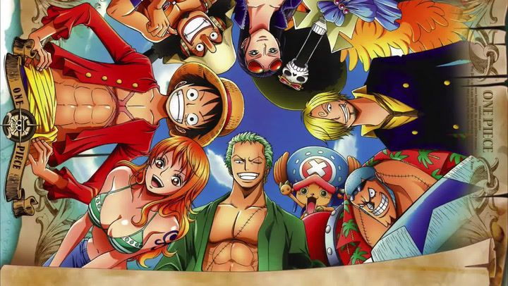
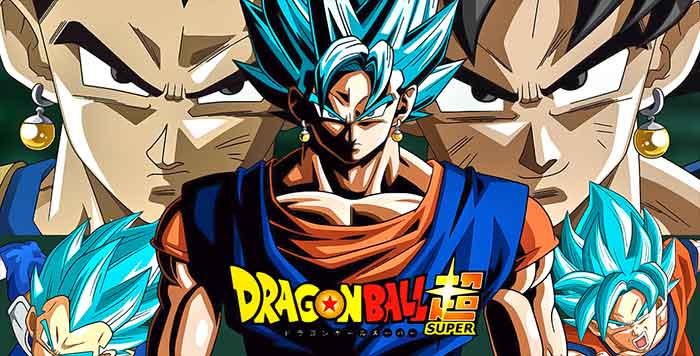
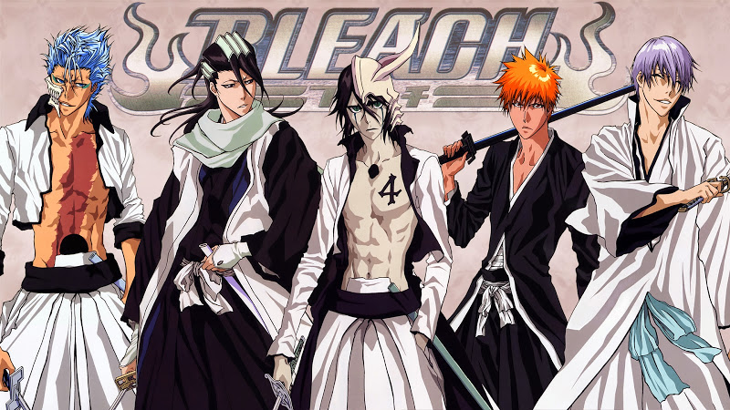
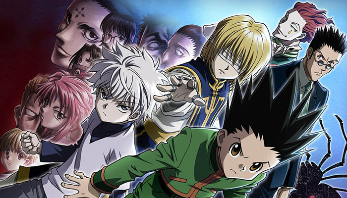
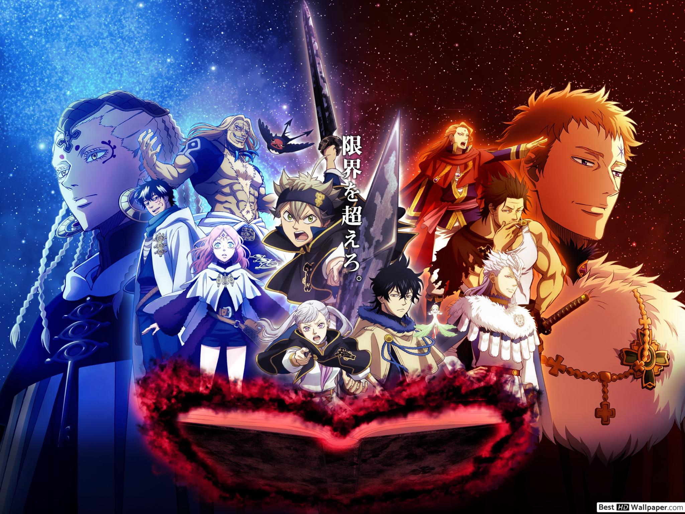
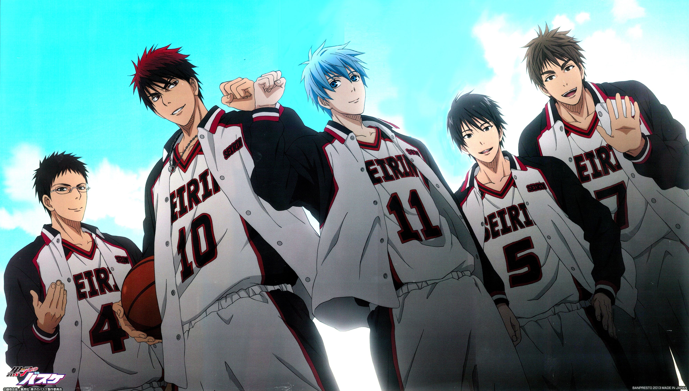
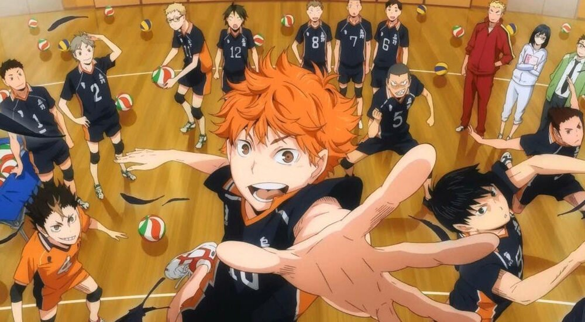
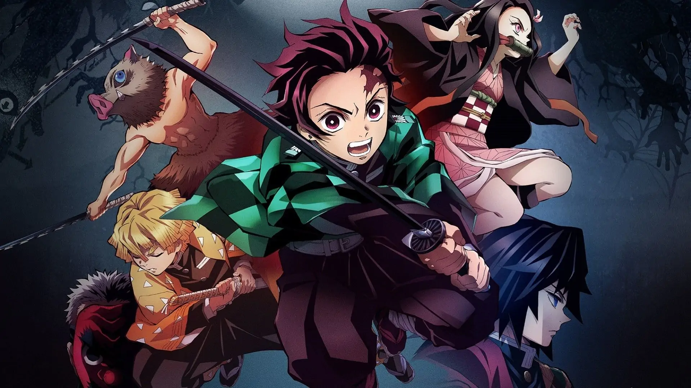

# 10 Oeuvres (Manga) #

## Je vous présente mes 10 oeuvres choisis pour ce travail ##

1. Naruto

    

### Description : ###

    - L'histoire commence pendant l'adolescence de Naruto, vers ses douze ans. Orphelin, éternel cancre et grand farceur, il fait toutes les bêtises possibles pour se faire remarquer. Son rêve : devenir Hokage afin d'être reconnu par les habitants de son village. En effet, le démon scellé en lui a attisé la crainte et le mépris des autres villageois, qui, avec le temps, ne font plus de différence entre le Kyūbi et Naruto. Malgré cela, Naruto s'entraîne dur afin de devenir genin, le premier niveau chez les ninjas

### Auteur : ###

    - Crée ne 1999 au Japon par Masashi Kishimoto

### Genres / Thèmes : ###

    - Action, Aventure, Comédie
    - Arts martiaux, Amitié, Combats, Guerre, Ninja

### Petit aperçu de Naruto : ###

- [Trailer Naruto](https://www.youtube.com/watch?v=DjITaSMdgpU&ab_channel=iampkbeast)

---------------------------------------------

2. One Piece

    

### Description : ###

    - Gloire, fortune et puissance, c'est ce que possédait Gold Roger, le tout puissant roi des pirates, avant de mourir sur l'échafaud. Mais ses dernières paroles ont éveillées bien des convoitises, et lança la fabuleuse "ère de la piraterie", chacun voulant trouver le fabuleux trésor qu'il disait avoir laissé.

    Bien des années plus tard, Shanks, un redoutable pirate aux cheveux rouges, rencontre Luffy, un jeune garçon d'une dizaine d'années dans un petit port de pêche. Il veut devenir pirate et le rejoindre, mais Shanks lui répond qu'il est trop jeune. Plus tard, Luffy avalera accidentellement le fruit Gomu Gomu qui rendra son corps élastique, mais aussi maudit par les eaux. Incapable de nager, Luffy ne veut pourtant pas renoncer à son rêve. Pour le consoler lorsqu'il part, Shanks lui offre son chapeau. Luffy jure alors de le rejoindre un jour avec son propre équipage.

    A 17 ans, Luffy prend la mer dans une petite barque avec pour but de réunir un équipage de pirates, mais de pirates pas comme les autres, qui devront partager sa conception un peu étrange de la piraterie. L'aventure est lancée.

 ### Auteur : ###

    - Crée en 1997 au Japon par Eichiro Oda

 ### Genres / Thèmes : ###

    - Action, Aventure, Drame
    - Amitié, combats, magie, pirates

  ### Petit aperçu de One piece : ###

   - [Trailer One piece](https://www.youtube.com/watch?v=LHTYpWI3S6Q&ab_channel=Cinema24Horas)  

   -----------------------------------------

   3. Dragon Ball

      

   ### Description : ###

    - Alors qu'elle parcourt les routes de montagnes à moto, Bulma fait une bien étrange rencontre en la personne de Sangoku, un petit garçon étonnamment fort, résistant et possédant une queue, comme les singes. Il possède un trésor qu'elle recherche, une boule de cristal, mais ne veut pas la lui céder, c'est un cadeaux que lui a laissé son grand-père Sangohan. Ils trouvent finalement un compromis, et Sangoku part avec elle à la recherche des 7 boules de cristal dont on dit qu'elles exaucent n'importe quel souhait une fois réunis. 

   ### Auteur : ###

    - Crée en 1984 au Japon par Akira Toriyama

   ### Genres / Thèmes : ###

    - Action, aventure, tournoi, comédie
    - Aliens/Extra-terrestres, arts martiaux, combats, magie, super pouvoirs

   ### Petit aperçu de Dragon Ball : ###

   - [Trailer Dragon Ball](https://www.youtube.com/watch?v=J5ilozFtLzs&ab_channel=FilmsActu)

   ---------------------------------------

4. Bleach

    

 ### Description : ###

     - Kurosaki Ichigo, un étudiant de quinze ans aux cheveux orange qui aime la bagarre (comme son père) a la particularité de voir les fantômes ainsi que de pouvoir les toucher. Cela l'amène à rencontrer Kuchiki Rukia, un Shinigami (dieu de la mort) qui combat un Hollow. Le déroulement du combat amène Kuchiki à donner ses pouvoirs à Ichigo qui deviens alors lui même un Shinigami. C'est maintenant à son tour de protéger la ville des Hollows.

### Auteur : ###

    - Crée en 2004 au Japon par Tite Kubo

### Genres / Thèmes : ###

    - Action, aventure, comédie, drame, surnature
    - Amitié, arts martiaux, combats, super pouvoirs

### Petit aperçu de Bleach : ###

 - [Trailer Bleach](https://www.youtube.com/watch?v=oZ67d9XSjFs&ab_channel=Palininja)

 ------------------

 5. Hunter X Hunter

    

### Description : ###

    - Gon Freeks est un jeune garçon provenant d'un petit village aimé des animaux. Il rêve de devenir Hunter afin de retrouver son père, le plus grand Hunter de tous, qu'il n'a jamais vu qu'en photo. Mais pour devenir Hunter professionnel, il faut passer plusieurs épreuves et tests très difficiles. Pendant les épreuves, Gon fait la connaissance d'amis tel que Kirua, Kurapica, Leorio mais de très dangereux combattants sont également présent afin de passer le test de Hunter.

### Genres / Thèmes : ###

    - Aventures, action, drame, comedie, fantasy
    - Assassinat, combats, vengeance

### Petit aperçu de Hunter X Hunter : ###

 - [Trailer HxH](https://www.youtube.com/watch?v=d6kBeJjTGnY&ab_channel=vizmedia)

 -----------

 6. Black Clover

     

### Description : ###

    - Asta et Yuno sont deux adolescents de 15 ans qui ont grandi ensemble dans un petit village du royaume de Clover. Leur but ultime à tous les deux est de devenir le prochain empereur-mage !
    Étrangement, dans ce royaume, Asta est le seul qui soit incapable de produire la moindre étincelle magique. Loin d'être découragé, il participe tout de même avec son ami (et rival) Yuno à la cérémonie annuelle de remise des grimoires qui rassemble les jeunes de 15 ans dans tout le royaume de Clover. Lors de cette cérémonie, Yuno recevra un grimoire légendaire. Ce qui n'est pas le cas d'Asta car malheureusement pour lui, aucun grimoire ne lui sera attribué ce jour là. Mais Asta ne se laissera pas abattre, peut importe les efforts qu'il aura à fournir, il compte bien rivaliser avec Yuno pour aller au bout de son rêve....

### Auteur : ###

    - Crée en 2015 au Japon par Yuuki Tabata

### Genres / Thèmes : ###

    - Action, aventure, fantasy
    - Amitié, magie

### Petit aperçu de Black Clover : ###

- [Trailer Black Clover](https://www.youtube.com/watch?v=MH4pWlX4LqI&ab_channel=AmazingAnime)

--------

7. Kuroko No Basket 

    

### Description : ###

    - La Génération Miracle, la fameuse équipe du collège Teikou composée de cinq génies. Une légende raconte qu'un sixième membre fantôme aurait fait partie de cette équipe, un membre que les cinq autres respectaient et considéraient comme leur supérieur.

    C'est la rentrée des classes au lycée Seirin et le club de basket compte désormais dans ses rangs Taiga Kagami, joueur impulsif et prometteur revenu d'Amérique, qui rêve d'écraser la Génération Miracle et devenir le numéro 1 du Japon, et Kuroko Tetsuya, garçon très effacé que personne ne remarque et peu doué pour le basket. Ce dernier aurait pourtant fait partie de la fameuse équipe de Teikou, à la grande surprise de tout le monde. Très vite, Kuroko s'intéressera à Kagami et décidera de l'aider à devenir le meilleur du Japon...  

### Auteur : ###

    - Crée en 2012 au Japon par Tadatoshi Fujimaki

### Genres / Thèmes : ###

    - Comédie, drame, tournois
    - Baskeball, ecole, sport

### Petit aperçu de Kuroko No Basket : ###

- [Trailer Black Clover](https://www.youtube.com/watch?v=MH4pWlX4LqI&ab_channel=AmazingAnime)

----------

8. Haikyuu

### Description : ###

    - Shôyô Hinata, surnommé Shô, aime plus que tout jouer au volley-ball et ce, malgré sa petite taille. Malheureusement, suite à une sévère défaite, son club de collège a été dissous, tous les membres étant partis.
    Mais Shô est bien décidé à jouer de nouveau et choisit son futur lycée en fonction de son ambition. Il intègre donc le lycée Karasuno, où a joué son idole, le Petit Géant, tout en espérant faire aussi bien que lui.

### Auteur : ###

    Crée en 2014 au Japon par Haruichi Furudate

### Genres / Thèmes : ###

    - Action, comedie, tournois
    - Ecole, sport, volley-ball

### Petit aperçu de Haikyuu : ###

- [Trailer Haikyuu](https://www.youtube.com/watch?v=EgSVKEckeH4&ab_channel=D0SKA)

---------

9. My Hero Academia

### Description : ###

    - Dans un monde où 80 % de la population possède un super‑pouvoir appelé alter, les héros font partie de la vie quotidienne. Et les super‑vilains aussi ! Face à eux se dresse l'invincible All Might, le plus puissant des héros ! Le jeune Izuku Midoriya en est un fan absolu. Il n'a qu'un rêve : entrer à la Hero Academia pour suivre les traces de son idole. Le problème, c'est qu'il fait partie des 20 % qui n'ont aucun pouvoir... Son destin est bouleversé le jour où sa route croise celle d'All Might en personne ! Ce dernier lui offre une chance inespérée de voir son rêve se réaliser. Pour Izuku, le parcours du combattant ne fait que commencer !

### Auteur : ### 

    Crée en 2014 au Japon par Kohei Horikoshi

### Genres / Thèmes : ###

    - Action, comedie, school life, surnaturel
    - Combats, ecole, super-héros, super pouvoirs

### Petit aperçu de My hero academia : ###

- [Trailer MHA](https://www.youtube.com/watch?v=KxDgJE0OEBI&ab_channel=Kaz%C3%A9)

-------------

10. Kimetsu No Yaiba

    

### Description : ###

    - Depuis les temps anciens, il existe des rumeurs concernant des démons mangeurs d'hommes qui se cachent dans les bois. Pour cette raison, les citadins locaux ne s'y aventurent jamais la nuit. La légende raconte aussi qu'un tueur de démons déambule la nuit, chassant ces démons assoiffés de sang. Pour le jeune Tanjirou, ces rumeurs vont bientôt devenir sa dure réalité ...

    Depuis la mort de son père, Tanjirou a pris sur lui pour subvenir aux besoins de sa famille. Malgré cette tragédie, ils réussissent à trouver un peu de bonheur au quotidien.

    Cependant, ce peu de bonheur se retrouve détruit le jour où Tanjirou découvre que sa famille s'est faite massacrer et que la seule survivante, sa sœur Nezuko, est devenue un démon. À sa grande surprise, Nezuko montre encore des signes d'émotion et de pensées humaines. Ainsi, commence la dure tâche de Tanjirou, celle de combattre les démons et de faire redevenir sa sœur humaine

### Auteur : ###

    - Crée en 2016 au Japon par Koyoharu Gotoge

### Genres / Thèmes : ###

    - Aventure, fantastique, historique
    - Démons

### Petit aperççu de Kimetsu no yaiba : ###

- [Trailer Kimetsu no Yaiba](https://www.youtube.com/watch?v=R-w4KLfgf8o&ab_channel=Wakanim)
